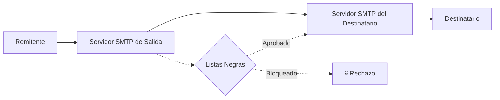
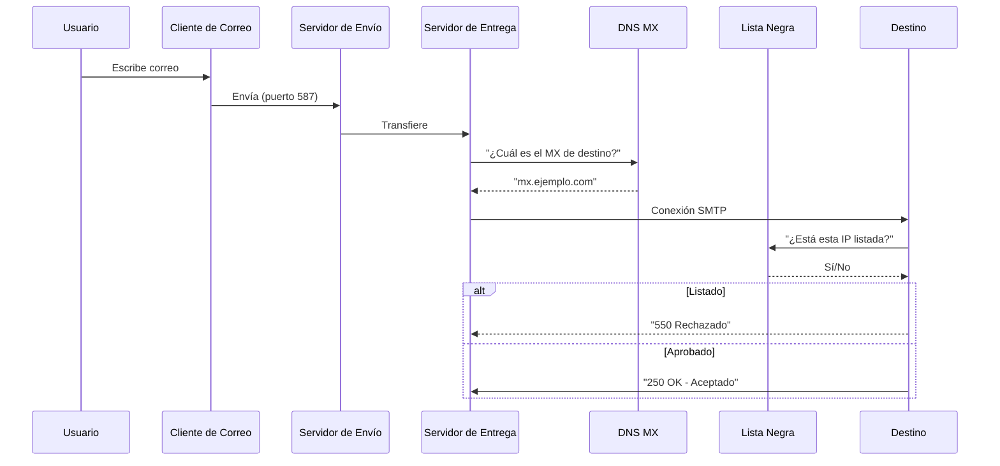

# Capítulo 2: Fundamentos Técnicos del Correo Electrónico

[← Anterior](01-introduccion.md) | [Índice](README.md) | [Siguiente →](03-que-es-una-lista-negra.md)

---

## 2.1 Anatomía de un Correo Electrónico

Para comprender cómo funcionan las listas negras, es necesario primero entender qué es un correo electrónico desde la perspectiva del protocolo, más allá de lo que ve el usuario en la interfaz de su cliente de correo. Un email no es un mensaje simple: es una estructura compuesta por dos partes claramente diferenciadas que viajan juntas a través de la red pero cumplen funciones distintas.

### 2.1.1 El Sobre vs. El Contenido

**El sobre SMTP (SMTP envelope)** es la información de transporte que los servidores de correo utilizan para encaminar el mensaje de un punto a otro de la red. Esta información es invisible para el usuario final y está compuesta por dos elementos fundamentales: `MAIL FROM` (también conocido como return-path o envelope-from) que indica la dirección del remitente a nivel de protocolo, y `RCPT TO` que indica la dirección del destinatario. Es importante entender que el `MAIL FROM` puede ser — y a menudo es — diferente de la dirección que aparece en la cabecera `From:` que ve el usuario. Por ejemplo, un boletín de marketing puede mostrar un `From:` corporativo como "newsletter@empresa.com" mientras que el `MAIL FROM` real es "bounce.xyz@mailing.proveedor.com". Esta distinción es crucial porque las listas negras y los sistemas de verificación SPF operan sobre el `MAIL FROM`, no sobre el `From:` visible.

**El contenido del mensaje (message header + body)** es la parte que el usuario final puede ver e incluye las cabeceras estándar como `From:` (dirección visible del remitente), `To:` (dirección visible del destinatario), `Subject:` (asunto), `Date:` (fecha y hora de envío), `Message-ID:` (identificador único del mensaje), `Received:` (registro de todos los servidores por los que pasó el mensaje), y `Return-Path:` (que normalmente coincide con el MAIL FROM). El cuerpo del mensaje puede contener texto plano, HTML, imágenes embebidas y adjuntos. Los sistemas antispam analizan tanto las cabeceras como el cuerpo para determinar si un mensaje es deseado o no.



> 📌 **Dato clave:** El `MAIL FROM` (envelope) y el `From:` (cabecera) pueden ser direcciones diferentes. Las listas negras normalmente operan sobre la IP del servidor remitente o el dominio del `MAIL FROM`, no sobre la dirección que el usuario ve como remitente.

### 2.1.2 El Viaje de un Correo: Paso a Paso

Cuando un usuario hace clic en "Enviar", su mensaje inicia un viaje complejo a través de múltiples sistemas antes de llegar a su destino. Cada paso de este viaje representa una oportunidad para que el mensaje sea inspeccionado, filtrado, retrasado o rechazado:

**Paso 1: Composición.** El usuario redacta el mensaje utilizando un MUA (Mail User Agent) como Microsoft Outlook, Mozilla Thunderbird, Gmail interfaz web, o Apple Mail. El MUA formatea el mensaje según los estándares RFC y lo prepara para su transmisión.

**Paso 2: Envío al MSA.** El MUA se conecta al MSA (Mail Submission Agent), generalmente en el puerto 587 utilizando STARTTLS para cifrar la conexión. El MSA verifica las credenciales del usuario (SMTP AUTH) y acepta el mensaje para su procesamiento. El puerto 587 es el estándar moderno; el puerto 25 está reservado para la transferencia entre servidores (MTA a MTA).

**Paso 3: Entrega al MTA.** El MSA transfiere el mensaje al MTA (Mail Transfer Agent), el servidor responsable del enrutamiento y la entrega. Los MTA más comunes son Postfix (el más popular en Linux), Exim (usado por cPanel), y Sendmail (el histórico, aunque cada vez menos común). El MTA coloca el mensaje en su cola de salida y determina la ruta de entrega.

**Paso 4: Resolución MX.** El MTA consulta los registros DNS MX (Mail Exchange) del dominio del destinatario. Por ejemplo, si el destinatario es `usuario@gmail.com`, el MTA consulta los registros MX de `gmail.com` y obtiene una lista priorizada de servidores, como `gmail-smtp-in.l.google.com` con prioridad 5, `alt1.gmail-smtp-in.l.google.com` con prioridad 10, etc.

**Paso 5: Transferencia SMTP.** El MTA remitente inicia una conexión SMTP con el MTA destinatario de mayor prioridad, intercambiando comandos como EHLO, MAIL FROM, RCPT TO, y finalmente DATA para transferir el contenido del mensaje.

**Paso 6: Verificaciones antispam.** El servidor receptor aplica una serie de filtros automatizados en milisegundos: consulta listas negras (DNSBL), verifica registros SPF, valida firmas DKIM, evalúa la política DMARC, analiza el contenido del mensaje con filtros bayesianos, y aplica reglas de puntuación (como SpamAssassin). Dependiendo del resultado, el mensaje puede ser aceptado, rechazado, marcado como spam, o puesto en cuarentena.

**Paso 7: Entrega al buzón.** Si el mensaje supera todas las verificaciones, es depositado en el buzón del destinatario. Si no, el servidor puede generar un código de error 5xx (rechazo permanente) que indica al remitente que no debe reintentar, o un código 4xx (rechazo temporal, como en greylisting) que indica que debe reintentar más tarde.



## 2.2 SMTP: El Protocolo del Correo

### 2.2.1 Comandos SMTP Esenciales

SMTP (Simple Mail Transfer Protocol) es el lenguaje que utilizan los servidores de correo para comunicarse entre sí. Fue definido originalmente en el RFC 821 en 1982 por Jon Postel, y actualizado significativamente por el RFC 5321 en 2008. A pesar de su edad, el protocolo ha demostrado ser extraordinariamente robusto y sigue siendo la base de todo el correo electrónico en internet.

Los comandos básicos que todo administrador debe conocer son:

| Comando | Función | Ejemplo |
|---------|---------|---------|
| `HELO/EHLO` | Saludo e identificación del servidor remitente | `EHLO mail.ejemplo.com` |
| `MAIL FROM` | Define la dirección del remitente (envelope) | `MAIL FROM:<bounce@ejemplo.com>` |
| `RCPT TO` | Define la dirección del destinatario | `RCPT TO:<usuario@destino.com>` |
| `DATA` | Indica el inicio de la transmisión del contenido | `DATA` |
| `QUIT` | Cierra la sesión SMTP | `QUIT` |
| `RSET` | Reinicia la transacción sin cerrar la conexión | `RSET` |
| `VRFY` | Solicita verificar si una dirección existe (deshabilitado por seguridad) | `VRFY usuario@dominio.com` |
| `EXPN` | Solicita expandir una lista de correo | `EXPN lista@dominio.com` |

### 2.2.2 Códigos de Respuesta SMTP

Cada comando SMTP genera una respuesta numérica de tres dígitos que indica el resultado de la operación. El primer dígito define la categoría general:

- **2xx (éxito):** El comando se ejecutó correctamente.
- **3xx (progreso):** El comando fue aceptado pero se requiere más información.
- **4xx (error temporal):** El comando falló pero puede reintentarse. El servidor remitente debe esperar un tiempo y volver a intentarlo.
- **5xx (error permanente):** El comando falló y no debe reintentarse sin corregir la causa.

| Código | Significado | Ejemplo típico |
|--------|-------------|----------------|
| 220 | Servicio listo | `220 mx.ejemplo.com ESMTP Postfix` |
| 250 | Acción solicitada completada | `250 OK` |
| 354 | Iniciar entrada de mensaje | `354 End data with <CR><LF>.<CR><LF>` |
| 450 | Buzón no disponible (temporal) | `450 4.1.1 User unknown` |
| 451 | Error de procesamiento local | `451 4.3.0 Temporary server error` |
| 452 | Almacenamiento insuficiente | `452 4.2.2 Over quota` |
| 550 | Buzón no disponible (permanente) | `550 5.1.1 User unknown` |
| 551 | Usuario no local | `551 5.1.1 User not local` |
| 552 | Espacio de almacenamiento excedido | `552 5.2.2 Mailbox full` |
| 553 | Nombre de buzón no permitido | `553 5.1.3 Invalid address` |
| 554 | Transacción fallida | `554 5.7.1 Service unavailable` |

> ⚠️ **Advertencia:** Cuando un servidor responde con un código 5xx citando una lista negra (por ejemplo, "550 5.7.1 blocked using zen.spamhaus.org"), se trata de un error permanente. No debes reintentar el envío automáticamente sin antes resolver el listado. Los reintentos continuos solo empeoran tu reputación. En cambio, los códigos 4xx permiten reintentos automáticos con backoff exponencial.

## 2.3 El Sistema de Nombres de Dominio (DNS)

### 2.3.1 DNS y el Correo Electrónico

El DNS (Domain Name System) es la agenda telefónica de internet, y juega un papel fundamental en el funcionamiento del correo electrónico en múltiples niveles. Sin DNS, los servidores de correo no podrían encontrar las direcciones de sus contrapartes, y las listas negras no podrían ser consultadas de forma eficiente.

Los registros DNS más relevantes para el correo electrónico son:

1. **Registros MX (Mail Exchange):** Indican qué servidores están autorizados para recibir correo en nombre de un dominio. Cada registro MX tiene una prioridad numérica; los servidores remitentes intentan primero la prioridad más baja (número más pequeño).
   ```txt
   ejemplo.com.  IN  MX  10  mail.ejemplo.com.
   ejemplo.com.  IN  MX  20  backup.ejemplo.com.
   ```

2. **Registros A/AAAA:** Resuelven nombres de servidores a direcciones IP (IPv4/IPv6). Son necesarios para que el servidor remitente pueda establecer la conexión TCP con el servidor destino.

3. **Registros PTR (Pointer Record):** Asocian una dirección IP a un nombre de dominio (resolución inversa o rDNS). Este registro es crítico para la reputación del remitente; muchos servidores receptores lo verifican y rechazan conexiones de IPs sin PTR o con PTR que no coincide con el nombre declarado en EHLO.

4. **Registros TXT:** Almacenan información textual arbitraria. En el contexto del correo, se utilizan para publicar registros SPF, DKIM y DMARC, que son los pilares de la autenticación de correo.

### 2.3.2 Cómo una DNSBL Usa el DNS

Las listas negras basadas en DNS (DNSBL) utilizan el protocolo DNS de una manera ingeniosa y elegante: convierten una dirección IP en un nombre de dominio y verifican si ese nombre existe en su zona DNS autoritativa. Si existe, la IP está listada; si no (NXDOMAIN), está limpia.

El proceso es sorprendentemente simple:

1. Se toma la dirección IP a verificar, por ejemplo `192.0.2.50`
2. Se invierten los octetos: `50.2.0.192`
3. Se concatena con el dominio de la lista negra: `50.2.0.192.zen.spamhaus.org`
4. Se realiza una consulta DNS de tipo A
5. Si la consulta devuelve una dirección IP (siempre en el rango `127.0.0.0/8`), la IP está listada y el código de retorno indica la categoría del listado
6. Si la consulta devuelve NXDOMAIN (el nombre no existe), la IP no está listada

```bash
# Ejemplo real de consulta a Spamhaus Zen
$ dig +short 2.0.0.127.zen.spamhaus.org
127.0.0.2
```

El resultado `127.0.0.2` indica que la IP `127.0.0.2` (usada aquí como ejemplo ilustrativo) estaría listada en Spamhaus SBL. En una consulta real, la IP sería la tuya.

```bash
# Consulta completa con explicación
$ dig 50.113.0.203.zen.spamhaus.org A

; <<>> DiG 9.18.0 <<>> 50.113.0.203.zen.spamhaus.org A
;; ->>HEADER<<- opcode: QUERY, status: NOERROR, id: 12345
;; flags: qr rd ra; QUERY: 1, ANSWER: 1, AUTHORITY: 0, ADDITIONAL: 0

;; ANSWER SECTION:
50.113.0.203.zen.spamhaus.org. 300 IN A    127.0.0.6
```

> 📌 **Dato clave:** Esta arquitectura es brillante porque **cualquier servidor DNS puede utilizarla** sin necesidad de instalar software especializado. La consulta a una DNSBL es simplemente una consulta DNS normal, lo que la hace extraordinariamente eficiente, escalable y fácil de implementar. Un servidor Postfix puede consultar listas negras con una simple línea de configuración.

### 2.3.3 TTL y Caching en DNSBL

Las respuestas de las listas negras suelen tener TTL (Time To Live) relativamente bajos, generalmente entre 300 y 3600 segundos (5 a 60 minutos). Esto es intencional y tiene dos propósitos importantes: permite que cuando una IP es removida de la lista, los servidores que la consultan obtengan la información actualizada rápidamente; y evita que falsos positivos persistan durante largos períodos en los cachés de los servidores.

> 💡 **Consejo:** Si utilizas un resolver DNS local como `unbound` o `dnsmasq` para cachear consultas, asegúrate de configurar TTL mínimos apropiados para las zonas DNSBL. De lo contrario, podrías estar usando información de listas negras desactualizada durante horas, bloqueando correos legítimos que ya deberían estar siendo aceptados.
