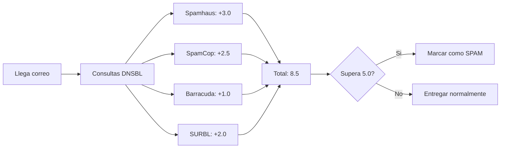

# Capítulo 6: Cómo Funcionan las DNSBL por Dentro

[← Anterior](05-principales-dnsbl.md) | [Índice](README.md) | [Siguiente →](07-motivos-de-inclusion.md)

---

## 6.1 Arquitectura Técnica de las DNSBL

La belleza de las listas negras basadas en DNS radica en su simplicidad arquitectónica. Aprovechan un protocolo que ya está instalado, configurado y funcionando en cada servidor de internet: el DNS. No requieren software especial, ni bases de datos locales, ni actualizaciones periódicas de reglas. Todo lo que necesitan es un resolver DNS funcional y unas pocas líneas de configuración en el servidor de correo.

### 6.1.1 El Mecanismo de Consulta DNS

Cuando un servidor de correo (como Postfix) necesita verificar si una IP remitente está en una lista negra, realiza una consulta DNS que sigue siempre el mismo patrón:

1. Toma la dirección IP a verificar, por ejemplo `192.0.2.45`
2. Invierte el orden de los octetos: `45.2.0.192`
3. Concatena con el dominio de la lista negra: `45.2.0.192.zen.spamhaus.org`
4. Realiza una consulta DNS de tipo **A** (dirección IPv4)
5. **Interpreta la respuesta:**
   - Si el DNS devuelve alguna dirección IP en el rango `127.0.0.0/8` → la IP está **listada**
   - Si el DNS devuelve **NXDOMAIN** (el nombre no existe) → la IP **no está listada**
   - Si el DNS devuelve **SERVFAIL** (error temporal del servidor) → la consulta falló, normalmente se trata como "no listado" para evitar falsos positivos por problemas técnicos

```bash
# Verificación de una IP en Spamhaus Zen
$ dig +short 45.2.0.192.zen.spamhaus.org A
127.0.0.2
```

Si el comando anterior devuelve `127.0.0.2`, la IP está listada en la SBL de Spamhaus. Si no devuelve nada, la IP está limpia.

```bash
# Verificación en múltiples listas simultáneamente
$ for lista in zen.spamhaus.org bl.spamcop.net b.barracudacentral.org; do
    resultado=$(dig +short 45.2.0.192.$lista A)
    [ -n "$resultado" ] && echo "LISTADO en $lista: $resultado" || echo "LIMPIO en $lista"
done
```

### 6.1.2 Consultas de Tipo A vs. Tipo TXT

Aunque la mayoría de las listas negras utilizan el registro **A** (que devuelve una dirección IP del rango 127.0.0.0/8 como código de estado), algunas también aceptan o incluso prefieren consultas de tipo **TXT** para proporcionar información adicional descriptiva:

```bash
# Con TXT, algunas listas devuelven un mensaje explicativo
$ dig 45.2.0.192.zen.spamhaus.org TXT +short
"https://www.spamhaus.org/query/ip/192.0.2.45"
```

El registro TXT normalmente contiene una URL que apunta a la página de información del listado, donde el administrador puede ver los detalles del caso. No todos los servidores de correo implementan la consulta TXT; la mayoría se limita al registro A por simplicidad y eficiencia.

### 6.1.3 TTL y Caching: El Doble Filo

Las respuestas de las DNSBL tienen TTL (Time To Live) inusualmente bajos en comparación con otros registros DNS. Mientras que un registro MX típico puede tener un TTL de una hora o más (3600 segundos), las respuestas de listas negras suelen tener TTL de entre 5 y 60 minutos (300 a 3600 segundos).

**Por qué los TTL son bajos:** La razón es que las listas negras cambian constantemente. Una IP puede ser listada y deslistada varias veces en un mismo día si el comportamiento del remitente fluctúa. Un TTL bajo garantiza que los servidores que consultan la lista obtengan información actualizada rápidamente.

**El problema del caching agresivo:** Si tu servidor de correo utiliza un resolver DNS local como `unbound` o `dnsmasq` para cachear consultas, podrías estar usando información desactualizada. Por ejemplo, si tu IP fue deslistada de Spamhaus hace 3 horas pero tu resolver local tiene un TTL mínimo configurado a 4 horas, seguirás viendo la IP como listada. Esto puede hacer que rechaces correos legítimos innecesariamente.

```bash
# Configurar TTL mínimo en unbound para evitar caching excesivo
# En /etc/unbound/unbound.conf:
server:
    cache-min-ttl: 60
    cache-max-ttl: 3600
```

> 💡 **Consejo:** Si administras un servidor de correo con alto volumen, considera no cachear las zonas DNSBL en absoluto, o al menos reducir el TTL mínimo a 60 segundos. El costo de una consulta DNS adicional es insignificante comparado con el costo de rechazar un correo legítimo por información desactualizada.

## 6.2 Scores y Ponderaciones: Por Qué No Todo es Blanco o Negro

Una de las concepciones erróneas más comunes sobre las listas negras es que funcionan como un interruptor binario: si estás listado, eres spam; si no, eres legítimo. En la realidad, la mayoría de los servidores de correo modernos utilizan sistemas de **puntuación (scoring)** que ponderan múltiples factores, incluyendo — pero no limitándose a — las listas negras.

### Cómo Funciona la Ponderación con SpamAssassin

SpamAssassin es el filtro de contenido más utilizado en servidores de correo Linux. Asigna puntos a cada característica sospechosa de un correo, y si la suma total supera un umbral configurable (típicamente 5.0), el mensaje es marcado como spam.

```perl
# Puntuaciones típicas de SpamAssassin para listas negras
score RCVD_IN_DNSBL         1.5    # Cualquier DNSBL genérica
score RCVD_IN_SPAMHAUS      3.0    # Spamhaus Zen
score RCVD_IN_SPAMCOP       2.5    # SpamCop
score RCVD_IN_BARRACUDA     1.0    # Barracuda BRBL
score RCVD_IN_PSBL          1.0    # PSBL
score RCVD_IN_SORBS         0.5    # SORBS (menor peso por su baja fiabilidad)
```

En este ejemplo, si un correo está en Spamhaus (+3.0) y SpamCop (+2.5), la suma es 5.5, superando el umbral de 5.0, y el mensaje es marcado como spam. Pero si solo está en Barracuda (+1.0), la suma es 1.0, muy por debajo del umbral, y el mensaje no es marcado como spam por esta razón.



> 📌 **Dato clave:** Estar en una sola lista negra con baja puntuación (como Barracuda con +1.0) generalmente no es suficiente para que un correo sea marcado como spam. El sistema de puntuación permite un enfoque matizado que reduce los falsos positivos.

## 6.3 Falsos Positivos: Causas, Impacto y Mitigación

Un **falso positivo** ocurre cuando una dirección IP o dominio legítimo es incorrectamente incluido en una lista negra. Es el peor escenario para un administrador de sistemas: tu servidor está configurado correctamente, envías correos legítimos que los destinatarios quieren recibir, pero no llegan porque una lista negra te ha marcado erróneamente.

### Causas Comunes de Falsos Positivos

**1. IP previamente usada por un spammer (IP rotación en la nube).** En entornos cloud (AWS, Google Cloud, DigitalOcean, Vultr), las direcciones IP se reasignan constantemente entre clientes. Puedes contratar un servidor y recibir una IP que el cliente anterior utilizó para enviar spam masivo. Tu IP "limpia" en realidad tiene un historial de abuso que la mantiene listada en varias listas. La solución es solicitar a tu proveedor un cambio de IP o verificar el historial de la IP antes de contratar.

**2. Reportes masivos incorrectos.** Una campaña de marketing perfectamente legítima puede generar reportes de spam si los destinatarios no recuerdan haberse suscrito, si el remitente no se identifica claramente, o si la frecuencia de envío es demasiado alta. SpamCop es particularmente vulnerable a este tipo de falsos positivos.

**3. Listas demasiado agresivas.** Listas como UCEPROTECT y SORBS (en ciertas épocas) listan rangos CIDR completos en lugar de IPs individuales, atrapando en la red a decenas de miles de servidores legítimos que comparten rango con un spammer.

**4. Honeypots mal configurados.** Aunque es raro, existen casos documentados donde direcciones spamtrap fueron activadas accidentalmente o expuestas a tráfico legítimo, generando falsos positivos.

**5. Asociación con proveedor abusivo.** Si tu proveedor de hosting alberga spammers en el mismo rango de IPs, tu servidor puede ser listado por asociación, incluso si tu comportamiento es ejemplar.

### Impacto de un Falso Positivo

- **Interrupción inmediata del negocio:** Los correos transaccionales (facturas electrónicas, confirmaciones de pedido, recuperación de contraseñas, notificaciones bancarias) dejan de llegar. Esto puede paralizar operaciones críticas.
- **Coste de oportunidad:** Ventas perdidas porque los clientes no reciben confirmaciones, enlaces de pago, o correos de seguimiento.
- **Carga administrativa:** Horas de trabajo del equipo de sistemas para diagnosticar, identificar la lista, entender la causa, implementar correcciones, y solicitar deslistes.
- **Daño reputacional persistente:** Algunas listas mantienen un historial de las IPs que han listado, incluso después del desliste. Una IP con historial de listados puede tener una reputación permanentemente dañada.

## 6.4 Cómo los Grandes Proveedores Utilizan las DNSBL

Cada proveedor importante de correo tiene su propia filosofía respecto a las listas negras, combinándolas con otros factores en proporciones diferentes.

### Gmail (Google Workspace)

Google utiliza las DNSBL como un factor más dentro de su algoritmo de Machine Learning, pero no como un determinante exclusivo. Su sistema analiza cientos de señales: el historial de interacciones de los usuarios (quién abre, quién hace clic, quién reporta como spam), la autenticación (SPF, DKIM, DMARC), la calidad del contenido, la reputación del dominio (no solo de la IP), y las relaciones entre dominios. Google también mantiene listas internas no públicas que son mucho más determinantes que cualquier DNSBL externa. Los remitentes pueden monitorear su reputación a través de Google Postmaster Tools (https://postmaster.google.com/).

### Outlook (Microsoft 365)

Microsoft utiliza un sistema de capas: primero verifica la conexión (TLS, reputación de IP), luego aplica filtros de contenido (SmartScreen), y finalmente refina con análisis de comportamiento. Las DNSBL, especialmente Spamhaus, se consultan en las primeras capas como filtro rápido. Microsoft ofrece el programa SNDS (Smart Network Data Services) para que los remitentes vean su reputación y métricas de quejas.

### Yahoo Mail

Yahoo fue uno de los primeros grandes proveedores en adoptar masivamente las DNSBL y tiene políticas particularmente estrictas con DMARC. Es conocido por ser uno de los proveedores más difíciles de complacer en términos de autenticación. Su programa Sender Hub permite a los remitentes registrarse y monitorear su reputación.

### ProtonMail

ProtonMail, conocido por su enfoque en la privacidad y el cifrado, es extremadamente restrictivo con conexiones no cifradas. Sus servidores consultan múltiples DNSBL y son particularmente sensibles a IPs sin STARTTLS o con configuraciones de seguridad deficientes.

> 📌 **Dato clave:** Estar limpio en Spamhaus es necesario pero no suficiente para llegar a la bandeja de entrada de Gmail. Necesitas también una buena reputación de dominio (DMARC en p=quarantine o reject), autenticación perfecta (SPF y DKIM), una tasa de quejas inferior al 0.1%, y un contenido de calidad que genere interacciones positivas (aperturas y clics).
