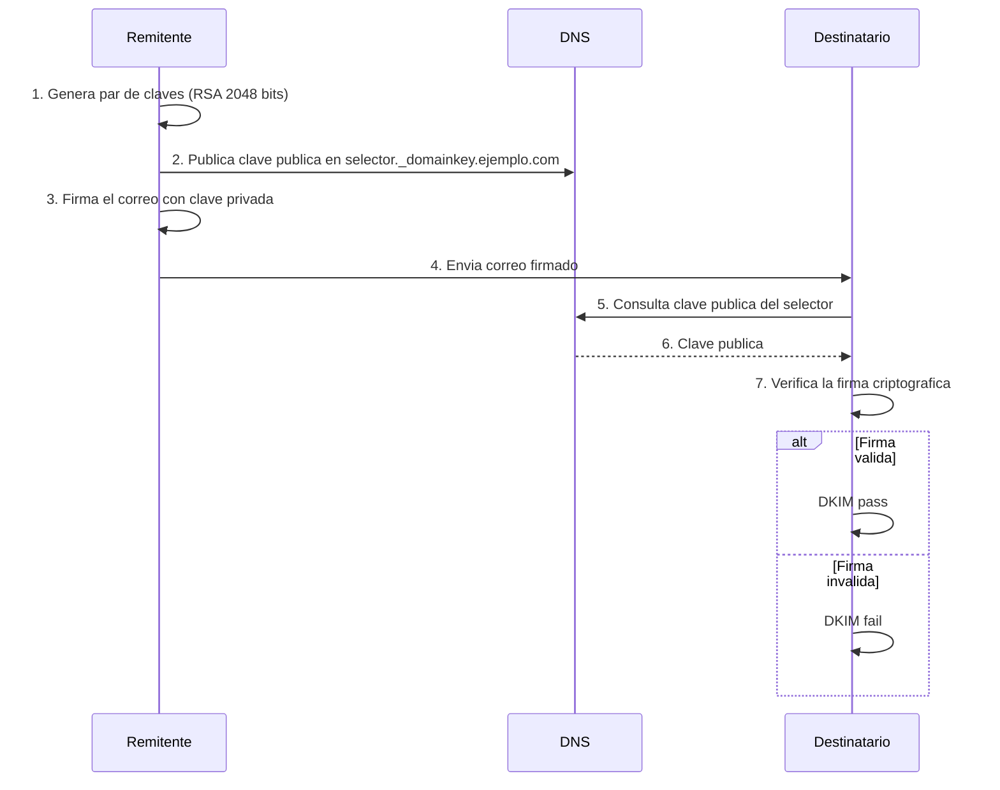

# Capítulo 9: SPF, DKIM y DMARC — El Santo Grial de la Autenticación

[← Anterior](08-como-detectar.md) | [Índice](README.md) | [Siguiente →](10-estrategias-desliste.md)

---

## 9.1 SPF (Sender Policy Framework)

### 9.1.1 ¿Qué es SPF y Por Qué es Necesario?

SPF (Sender Policy Framework) es un estándar de autenticación de correo electrónico definido en el RFC 7208 que permite al propietario de un dominio especificar públicamente qué servidores están autorizados a enviar correo en nombre de ese dominio. Funciona mediante la publicación de un registro TXT en el DNS del dominio que lista las direcciones IP o nombres de servidor autorizados.

Antes de SPF, cualquier servidor podía falsificar la dirección de remitente de un correo (una práctica conocida como email spoofing). Un atacante podía enviar un correo haciéndose pasar por `admin@tu-banco.com` sin que el servidor receptor tuviera forma de verificar si ese servidor estaba realmente autorizado por el dominio `tu-banco.com`. SPF cerró esta vulnerabilidad al permitir que los servidores receptores verifiquen que la IP del servidor remitente está en la lista de servidores autorizados publicada por el dominio.

### 9.1.2 Sintaxis Completa de SPF

```txt
ejemplo.com.  IN  TXT  "v=spf1 ip4:203.0.113.0/24 include:_spf.google.com -all"
```

**Mecanismos principales:**

| Mecanismo | Descripción | Ejemplo |
|-----------|-------------|---------|
| `ip4:` | Autoriza una IP o rango IPv4 | `ip4:203.0.113.50`, `ip4:203.0.113.0/24` |
| `ip6:` | Autoriza una IP o rango IPv6 | `ip6:2001:db8::/32` |
| `include:` | Incluye los servidores de otro dominio | `include:_spf.google.com` |
| `a` | Autoriza la(s) IP(s) del registro A del dominio | `a` |
| `mx` | Autoriza las IPs de los registros MX del dominio | `mx` |
| `exists:` | Verifica si un nombre DNS existe (macros) | `exists:%{i}._spf.%{d}` |
| `all` | Política para todos los servidores no listados | `-all`, `~all`, `?all` |

**Calificadores (lo que pasa cuando un servidor no coincide con ningún mecanismo):**

| Calificador | Nombre | Significado |
|-------------|--------|-------------|
| `+` (pass) | Aprobado | El servidor está autorizado |
| `-` (fail) | **Rechazar** | El servidor NO está autorizado. Rechazar el correo |
| `~` (softfail) | Sospechoso | Probablemente no autorizado. Aceptar pero marcar |
| `?` (neutral) | Neutral | No hay afirmación. Actuar según otras reglas |

**Ejemplo completo con explicación línea por línea:**

```txt
; Dominio: ejemplo.com
; v=spf1 — version
; ip4:203.0.113.50 — autoriza a este servidor concreto
; ip4:198.51.100.0/24 — autoriza todo este rango de IPs
; include:_spf.google.com — autoriza los servidores de Google (Gmail/Workspace)
; include:spf.sendgrid.net — autoriza los servidores de SendGrid
; mx — autoriza las IPs listadas en los registros MX del dominio
; -all — RECHAZA cualquier otro servidor no listado
v=spf1 ip4:203.0.113.50 ip4:198.51.100.0/24 include:_spf.google.com include:spf.sendgrid.net mx -all
```

### 9.1.3 Errores Comunes y Cómo Evitarlos

**1. Superar el límite de 10 consultas DNS.** SPF tiene un límite estricto de 10 consultas DNS por evaluación. Cada `include:` cuenta como una consulta, y cada inclusión puede a su vez incluir otras inclusiones. Si superas este límite, SPF devuelve "permerror" (error permanente), lo que normalmente resulta en rechazo del correo.

```bash
# Verificar cuantas consultas DNS tiene tu SPF
$ dig +short TXT ejemplo.com | grep -oP 'include:\K[^\s]+' | wc -l
```

**2. SPF demasiado permisivo.** Usar `+all` o simplemente no incluir `all` al final desactiva la protección. Esto equivale a decir "cualquier servidor puede enviar correo desde mi dominio".

**3. Olvidar servicios de terceros.** Si usas SendGrid, Mailgun, Mailchimp o cualquier otro servicio para enviar correo, debes incluir sus rangos de IP en tu SPF. Si no lo haces, los correos enviados a través de esos servicios fallarán la verificación SPF.

**4. No actualizar SPF después de cambios.** Si cambias de proveedor de hosting, de servidor de correo, o de servicio de email transaccional, actualiza tu SPF inmediatamente.

## 9.2 DKIM (DomainKeys Identified Mail)

### 9.2.1 ¿Qué es DKIM?

DKIM (DomainKeys Identified Mail) es un estándar definido en el RFC 6376 que permite firmar digitalmente los correos electrónicos utilizando criptografía de clave pública. A diferencia de SPF, que solo verifica qué servidores están autorizados, DKIM garantiza que el contenido del mensaje no ha sido alterado durante el tránsito y que fue enviado por el propietario legítimo del dominio.

### 9.2.2 Cómo Funciona DKIM

El proceso de DKIM involucra dos partes: el remitente firma el correo con una clave privada, y el receptor verifica la firma usando una clave pública publicada en el DNS. El "selector" es un nombre arbitrario que permite tener múltiples claves DKIM simultáneas, facilitando la rotación de claves sin interrumpir el servicio.



### 9.2.3 Configuración Paso a Paso de DKIM en Postfix

**Paso 1: Generar las claves**

```bash
# Generar clave privada RSA de 2048 bits (el estandar recomendado)
$ openssl genrsa -out dkim-private.pem 2048

# Extraer la clave publica
$ openssl rsa -in dkim-private.pem -pubout -out dkim-public.pem
```

**Paso 2: Instalar y configurar OpenDKIM**

```bash
# En Debian/Ubuntu
$ apt install opendkim opendkim-tools

# Configurar /etc/opendkim.conf
$ cat <<EOF | sudo tee /etc/opendkim.conf
Domain                  ejemplo.com
Selector                mail
KeyFile                 /etc/opendkim/keys/ejemplo.com/mail.private
Socket                  inet:12345@localhost
EOF
```

**Paso 3: Publicar el registro DNS**

Debes extraer la clave pública en formato adecuado para DNS:

```bash
$ opendkim-genkey -D /etc/opendkim/keys/ejemplo.com/ -d ejemplo.com -s mail
```

Esto genera el archivo `mail.txt` con el registro DNS que debes publicar:

```txt
mail._domainkey.ejemplo.com.  IN  TXT  "v=DKIM1; h=sha256; k=rsa; p=MIGfMA0GC..."
```

**Paso 4: Integrar OpenDKIM con Postfix**

```bash
# En /etc/postfix/main.cf
milter_default_action = accept
milter_protocol = 2
smtpd_milters = inet:localhost:12345
non_smtpd_milters = inet:localhost:12345
```

## 9.3 DMARC (Domain-based Message Authentication, Reporting & Conformance)

### 9.3.1 ¿Qué es DMARC?

DMARC (definido en el RFC 7489) es la capa final de autenticación que unifica SPF y DKIM, y le dice al servidor receptor qué hacer cuando un correo falla ambas verificaciones. Además, DMARC proporciona un mecanismo de reportes que permite al propietario del dominio recibir información sobre quién está enviando correo en su nombre y si esos correos están pasando o fallando la autenticación.

### 9.3.2 Sintaxis Completa de DMARC

```txt
_dmarc.ejemplo.com.  IN  TXT  "v=DMARC1; p=reject; sp=reject; pct=100; rua=mailto:dmarc@ejemplo.com; ruf=mailto:forensic@ejemplo.com; fo=1; adkim=s; aspf=s"
```

| Etiqueta | Requerido | Valores | Descripción |
|----------|:---------:|---------|-------------|
| `v` | Sí | `DMARC1` | Versión del estándar |
| `p` | Sí | `none`, `quarantine`, `reject` | Política para el dominio principal |
| `sp` | No | `none`, `quarantine`, `reject` | Política para subdominios (hereda de p si no se especifica) |
| `pct` | No | 1-100 (default 100) | Porcentaje de correos a los que aplicar la política |
| `rua` | No | `mailto:` | Dirección para recibir reportes agregados (XML) |
| `ruf` | No | `mailto:` | Dirección para recibir reportes forenses |
| `fo` | No | `0`, `1`, `d`, `s` | Opciones de generacion de reportes forenses |
| `adkim` | No | `r` (relajado), `s` (estricto) | Modo de alineación DKIM |
| `aspf` | No | `r` (relajado), `s` (estricto) | Modo de alineacion SPF |

### 9.3.3 Estrategia de Implementación por Fases

La implementación de DMARC debe hacerse gradualmente para evitar bloquear tráfico legítimo.

**Fase 1: Monitoreo (p=none) — Duración: 2 a 4 semanas**

```txt
v=DMARC1; p=none; rua=mailto:dmarc@ejemplo.com
```

En esta fase, DMARC no afecta la entrega de correos. Simplemente recopila información sobre qué servidores están enviando correo desde tu dominio y si están pasando SPF o DKIM. Revisa los reportes semanalmente para identificar:
- ¿Qué servicios legítimos están fallando autenticación?
- ¿Hay servidores desconocidos que deberías investigar?
- ¿Hay dominios que están intentando suplantarte (spoofing)?

**Fase 2: Cuarentena (p=quarantine) — Duración: 2 a 4 semanas**

```txt
v=DMARC1; p=quarantine; rua=mailto:dmarc@ejemplo.com
```

Los correos que fallan SPF y DKIM son enviados a la carpeta de spam en lugar de ser rechazados. Esto permite identificar falsos positivos sin perder correos. Monitorea los reportes para asegurarte de que todo el tráfico legítimo está siendo autenticado correctamente.

**Fase 3: Rechazo (p=reject) — Permanente**

```txt
v=DMARC1; p=reject; rua=mailto:dmarc@ejemplo.com; ruf=mailto:forensic@ejemplo.com
```

Protección máxima. Los correos no autenticados son rechazados en la puerta de entrada. Esto elimina casi por completo la posibilidad de que alguien suplante tu dominio.

## 9.4 BIMI (Brand Indicators for Message Identification)

BIMI es un estándar emergente que permite a las marcas mostrar su logotipo oficial junto a sus correos en los buzones de los proveedores que lo soportan (actualmente Gmail y Apple Mail). Además del beneficio de marca, BIMI tiene el efecto secundario positivo de mejorar la entregabilidad, ya que requiere DMARC en `p=quarantine` o `p=reject`.

```txt
default._bimi.ejemplo.com.  IN  TXT  "v=BIMI1; l=https://ejemplo.com/logo.svg; a=https://ejemplo.com/certificate.pem"
```

## 9.5 ARC (Authenticated Received Chain)

ARC resuelve un problema complejo: cuando un correo pasa por un servicio de reenvío (como Google Groups, una lista de correo, o un sistema de forwarding), las verificaciones SPF y DKIM pueden fallar porque el servidor que realiza el reenvío no está autorizado en el SPF original. ARC preserva la cadena de autenticación a través de estos intermediarios, permitiendo que el destinatario final sepa que el correo fue autenticado originalmente, aunque haya pasado por un reenviador legítimo.
